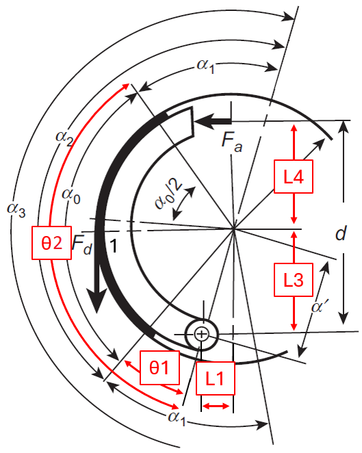
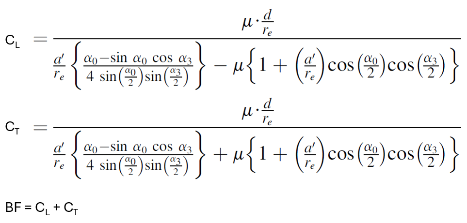
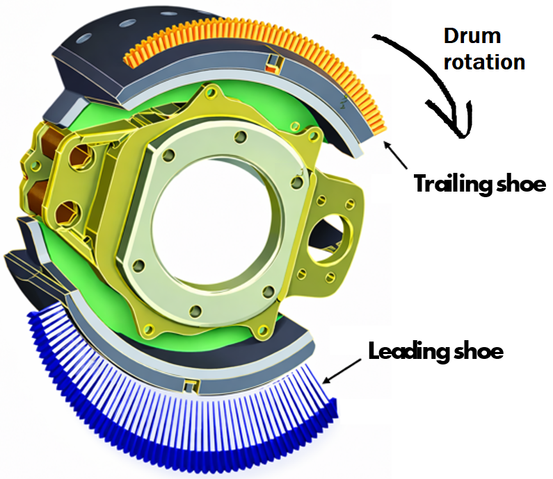

# OptiBF — Brake Factor Optimization

A Python-based engineering tool for the analysis and optimization of S-Cam
drum brake geometry.

OptiBF combines analytical brake modeling, parametric analysis, numerical
optimization and engineering visualization into an interactive Streamlit
dashboard.

---

## Overview

Brake factor is strongly influenced by the geometry of the S-Cam brake system,
including lever dimensions, cam geometry and friction conditions.

OptiBF was developed to provide an engineering-oriented computational
framework for evaluating these relationships and identifying improved brake
geometries within defined design constraints.

---

## Dashboard

The OptiBF dashboard provides an interactive environment for:

- Brake factor calculation
- Parametric geometry evaluation
- Geometry sensitivity analysis
- Numerical optimization
- Comparison between current and optimized configurations
- Engineering visualization



---

## Engineering Model

The model evaluates the mechanical behavior of an S-Cam drum brake system
using the main geometric parameters:

- **L1** — input lever dimension
- **L3** — shoe lever geometry
- **L4** — shoe lever geometry
- **θ1** — geometric angle
- **θ2** — geometric angle
- **μ** — friction coefficient

The design variables can be evaluated individually or simultaneously to
investigate their influence on brake factor.

---

## Optimization Methodology

OptiBF uses a parametric engineering model combined with numerical
optimization techniques to explore the design space.

The broader development of the tool includes:

- Design of Experiments (DOE)
- Response Surface Methodology (RSM)
- Sensitivity analysis
- Numerical optimization
- Independent validation
- Engineering data analysis

The objective is not simply to maximize brake factor, but to identify
geometries that provide improved performance while respecting predefined
engineering constraints.

---

## Engineering Visualization

The project includes engineering visualizations of the brake equations,
brake geometry and self-energizing behavior.





---

## Project Structure

```text
OptiBF/
│
├── app.py
├── abrir_dashboard.bat
├── brake_equations.png
├── brake_geometry.png
├── brake_self_energizing.png
├── README.md
│
└── core/
    ├── __init__.py
    ├── brake_model.py
    └── optimization.py
```

---

## How to Run

### Requirements

Python 3.x and the dependencies listed in `requirements.txt`.

### Installation

Clone the repository:

    git clone https://github.com/cassiobelo/OptiBF.git
    cd OptiBF

Install the required packages:

    pip install -r requirements.txt

### Launch the Dashboard

Run:

    streamlit run app.py

The dashboard will open in your browser.

On Windows, the included batch file can also be used:

    abrir_dashboard.bat

---

## Engineering Background

OptiBF was developed as part of a broader engineering research project
focused on commercial vehicle drum brake systems.

The project combines mechanical engineering fundamentals with computational
methods including:

- Mechanical modeling
- Numerical optimization
- Design of Experiments
- Response Surface Methodology
- Sensitivity analysis
- Python-based engineering tools

---

## Related Research

The associated research was presented at SAE Brasil.

**Influence of Wheel Stiffness on Brake Drum Deformation in Commercial Vehicles**

Technical Paper: **2026-36-0309**

[Read the paper on SAE Mobilus](https://saemobilus.sae.org/papers/influence-wheel-stiffness-brake-drum-deformation-commercial-vehicles-2026-36-0309)

---

## Author

**Cassio Belo Clemente de Souza**

Mechanical / Materials Engineer  
Product Engineering | Commercial Vehicles | CAE | Brake Systems

GitHub: https://github.com/cassiobelo